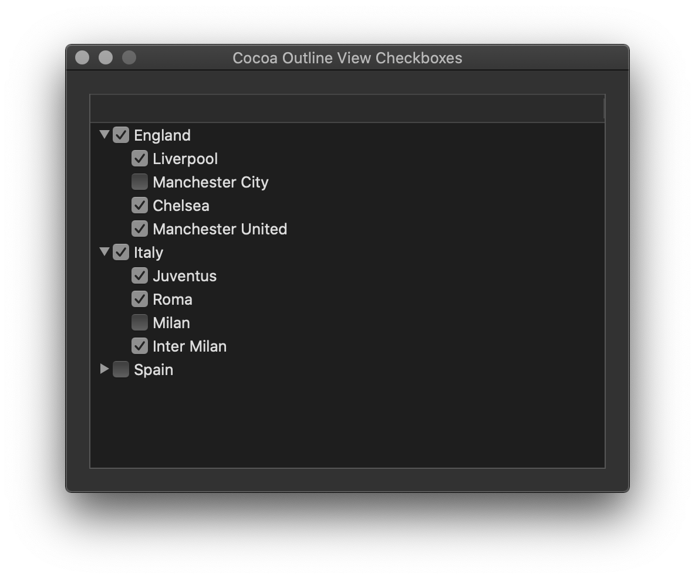

# Cocoa Outline View with Checkbox

This repository contains implementation of view based NSOutlineView with checkbox cells and with data source and delegate set programmatically.

[Cocoa macOS Examples](https://github.com/NikolaGrujic91/Cocoa-macOS-Examples)

